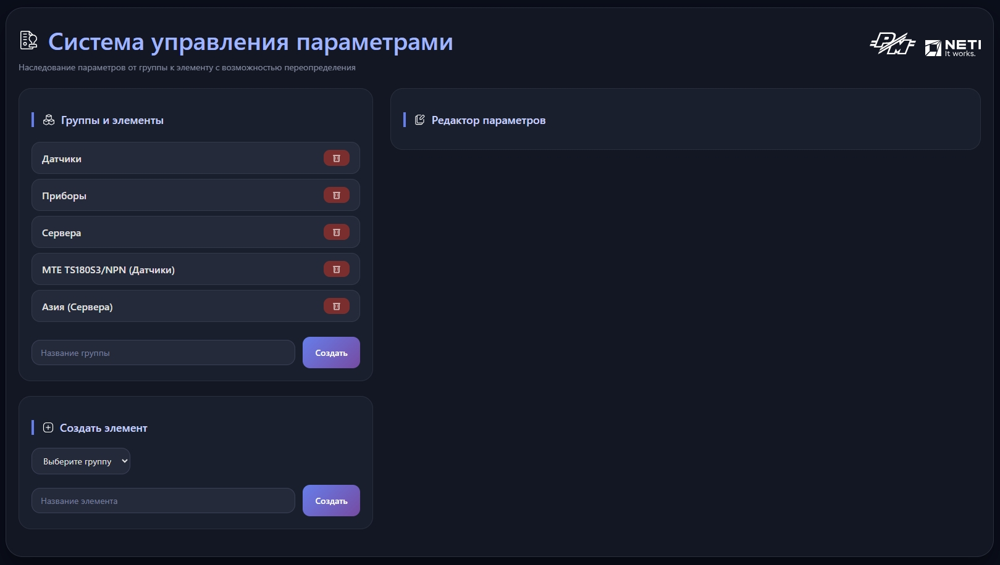
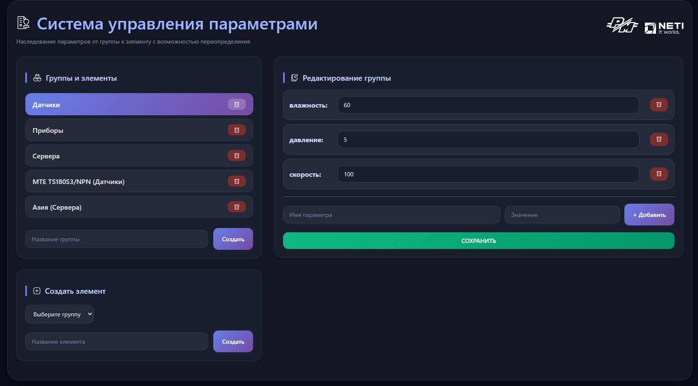
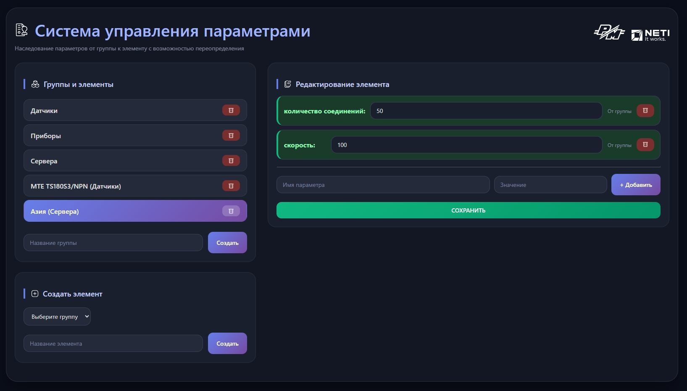
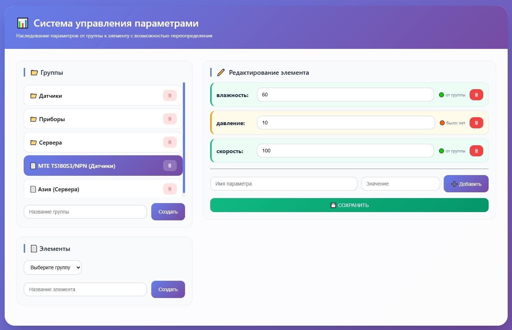

# Система управления параметрами с наследованием

Система позволяет управлять параметрами групп и элементов с поддержкой наследования. Параметры группы автоматически применяются ко всем элементам, но могут быть переопределены на уровне элемента.

## Возможности

- Создание/удаление групп и элементов
- Наследование параметров от группы к элементу
- Переопределение параметров на уровне элемента
- Визуальное отличие (зелёный — унаследовано, оранжевый — переопределено)

## Пример использования

### Главный экран

### Редактирование группы

### Наследование параметров (зелёный цвет)

### Переопределение параметра (оранжевый цвет)

## Установка и запуск

git clone https://github.com/juliapodik/Parameter-management-system-with-inheritance.git  
cd D:\my_project\backend  
pip install fastapi uvicorn  
py -m uvicorn api:app --reload  
